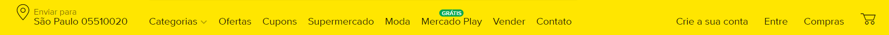
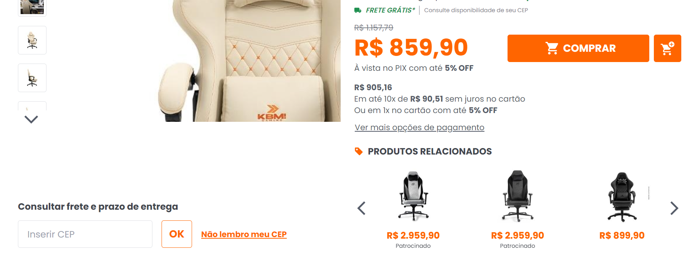
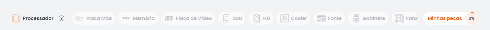
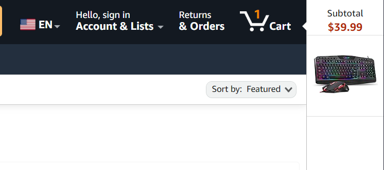
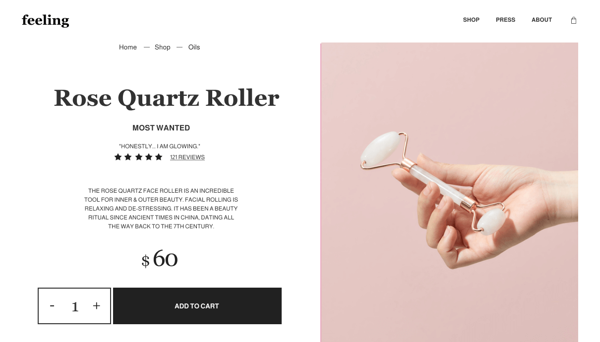
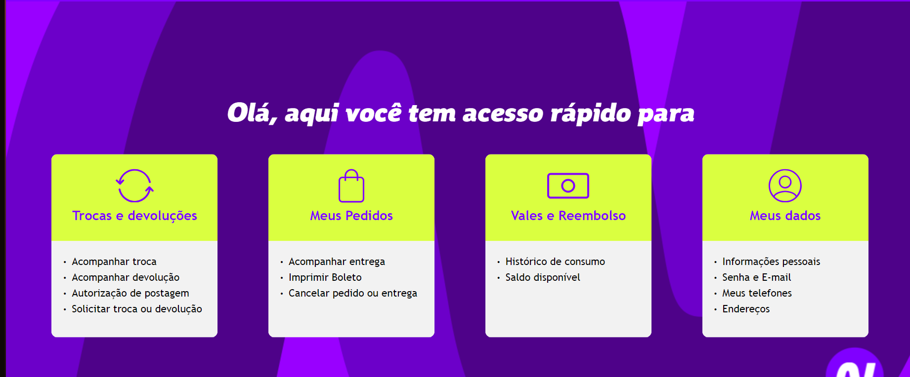
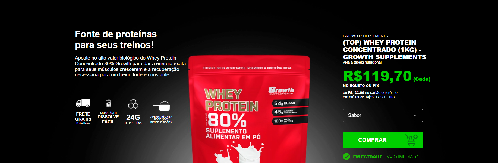
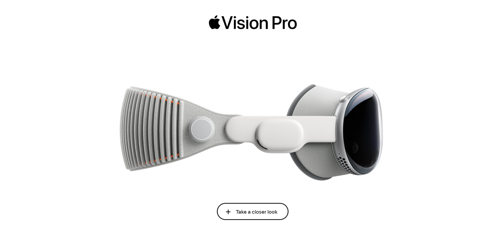
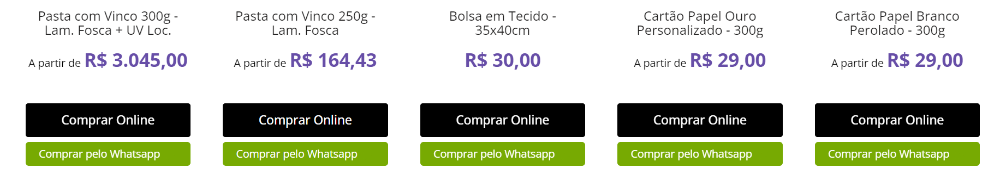

# Benchmarking

Este documento tem como objetivo apresentar uma análise de benchmarking, comparando características de outros ecommerces, tanto dentro do nicho de gráficas que vendem adesivos quanto fora dele. A análise visa identificar funcionalidades e estratégias que possam agregar valor ao ecommerce de adesivos, destacando pontos de vantagem e aplicabilidade.  

O intuito de realizar este benchmarking é obter uma visão ampla das melhores práticas de mercado, aproveitando tanto as inovações quanto as abordagens consagradas em outros setores, para melhorar a experiência do usuário, aumentar a taxa de conversão e otimizar processos internos. Com base nas informações coletadas, será possível adaptar e implementar soluções que atendam de forma eficaz às necessidades dos clientes e ao modelo de negócio da gráfica.

## Fora do Nicho

Diversos ecommerces, embora não especializados em adesivos, apresentam características que podem ser adotadas para melhorar a experiência do usuário, a navegabilidade e o processo de compra. Abaixo estão alguns tópicos chave e as vantagens que oferecem.

#### CEP na Barra de Navegação
Adicionar o campo para inserção de CEP diretamente na barra de navegação proporciona ao cliente informações rápidas sobre prazo e custo de frete. Essa funcionalidade aumenta a transparência e agiliza a decisão de compra, especialmente para produtos físicos como adesivos.

#### Comparação de Produtos Similares
Oferecer uma funcionalidade de comparação de adesivos similares ou com especificações parecidas pode ajudar o cliente a tomar uma decisão mais informada, aumentando as chances de conversão ao facilitar a escolha do produto ideal.

#### STEPS para Montagem e Avaliação do Produto
Exibir um guia passo a passo para a aplicação dos adesivos, juntamente com avaliações de clientes, cria confiança e reduz dúvidas sobre o uso do produto. Essa estratégia educa o consumidor e demonstra como o produto pode ser aplicado no dia a dia.

#### Carrinho Otimizado
Carrinhos de compra com funcionalidades avançadas, como previsão de entrega, fácil modificação de itens e sugestões personalizadas, melhoram a experiência de checkout e reduzem o abandono de carrinho, algo crucial para aumentar as vendas.

#### Avaliação de Produtos
A avaliação de produtos com comentários e classificação visual é um fator de credibilidade, permitindo que novos clientes se sintam mais seguros ao adquirir adesivos de alta qualidade, especialmente se houver uma grande variedade de modelos.

#### Acesso Rápido ao FAQ
Ter um FAQ de fácil acesso diretamente na página do produto ou no carrinho oferece respostas rápidas às dúvidas mais frequentes, reduzindo a necessidade de contato com o suporte e acelerando o processo de compra.

#### Informações Rápidas e Programa de Fidelidade
Oferecer informações rápidas sobre o produto, políticas de entrega, além de um programa de pontos de fidelidade, pode gerar um maior engajamento dos clientes recorrentes, incentivando compras futuras e criando uma relação mais forte com a marca.

#### UX Avançada
Investir em uma experiência de usuário fluida e intuitiva melhora a percepção do ecommerce como um todo, oferecendo uma navegação simples, rápida e visualmente agradável, o que pode ser um diferencial importante no mercado de adesivos.

## Dentro do Nicho

Analisando outras gráficas que vendem adesivos e produtos relacionados, encontramos funcionalidades específicas para o nicho que ajudam a melhorar a personalização do produto, a experiência do cliente e a eficiência do processo de compra.

#### Compra Online via WhatsApp e Descontos
A integração com o WhatsApp para finalização de compras permite um atendimento mais personalizado e próximo ao cliente, especialmente em casos onde há a necessidade de personalização de adesivos. Além disso, promoções e descontos rápidos podem ser ofertados diretamente no chat, aumentando as chances de conversão.

#### Prazo de Produção e Frete
Apresentar informações detalhadas sobre o gabarito do adesivo, tempo de produção e prazos de entrega ajuda a alinhar as expectativas do cliente e evitar frustrações. Isso é essencial para adesivos personalizados, onde a precisão do design e os prazos são decisivos.

#### Quantidade de Detalhes e Encaixe de Imagem (Gráfica Paulista)
Permitir que o cliente visualize detalhadamente como o adesivo será impresso e aplicado, garantindo que o encaixe do design esteja correto, aumenta a confiança na compra de produtos personalizados. Isso diminui o risco de insatisfação com o produto final.

#### Passo a Passo e Dicas de Aplicação (ZAPGRÁFICA)
Uma seção que forneça orientações passo a passo para aplicação dos adesivos, juntamente com dicas práticas, reduz o risco de erros no uso do produto e aumenta a satisfação do cliente, especialmente para clientes que compram adesivos pela primeira vez.

#### Chat de Atendimento (Gráfica Online SP)
Oferecer um chat para tirar dúvidas em tempo real durante o processo de compra pode evitar desistências e ajudar a solucionar dúvidas específicas, proporcionando um atendimento eficiente e personalizado.

#### Organização da Navegação e Interface (Printi)
Uma interface organizada e intuitiva, com menus claros e categorização eficiente dos adesivos, facilita a navegação e garante uma experiência mais agradável, essencial para reter clientes e tornar a busca pelo produto mais rápida.

#### Métricas e Preview (Etiquetas e Adesivos)
Mostrar previews em tempo real de como o adesivo ficará após a personalização e fornecer métricas claras, como dimensões e acabamento, ajuda o cliente a visualizar o produto final, aumentando a precisão e satisfação com a compra.
