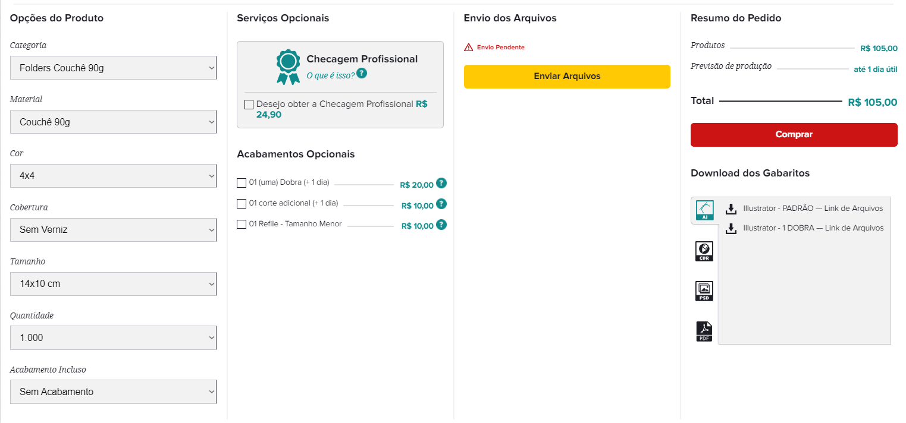
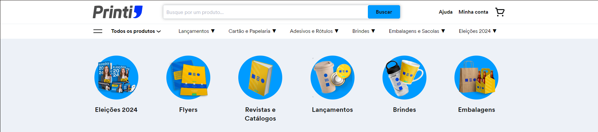

# Benchmarking para Ecommerce de Adesivos

Este documento tem como objetivo apresentar uma análise de benchmarking, comparando características de outros ecommerces, tanto dentro do nicho de gráficas que vendem adesivos quanto fora dele. A análise visa identificar funcionalidades e estratégias que possam agregar valor ao ecommerce de adesivos, destacando pontos de vantagem e aplicabilidade.

O intuito de realizar este benchmarking é obter uma visão ampla das melhores práticas de mercado, aproveitando tanto as inovações quanto as abordagens consagradas em outros setores, para melhorar a experiência do usuário, aumentar a taxa de conversão e otimizar processos internos. Com base nas informações coletadas, será possível adaptar e implementar soluções que atendam de forma eficaz às necessidades dos clientes e ao modelo de negócio da gráfica.

## Fora do Nicho

Diversos ecommerces, embora não especializados em adesivos, apresentam características que podem ser adotadas para melhorar a experiência do usuário, a navegabilidade e o processo de compra. Abaixo estão alguns tópicos chave e as vantagens que oferecem.

#### CEP na Barra de Navegação
Adicionar o campo para inserção de CEP diretamente na barra de navegação proporciona ao cliente informações rápidas sobre prazo e custo de frete. Essa funcionalidade aumenta a transparência e agiliza a decisão de compra, especialmente para produtos físicos como adesivos.

#### Comparação de Produtos Similares
Oferecer uma funcionalidade de comparação de adesivos similares ou com especificações parecidas pode ajudar o cliente a tomar uma decisão mais informada, aumentando as chances de conversão ao facilitar a escolha do produto ideal.

#### STEPS para Montagem e Avaliação do Produto
Fornecer um guia visual que ilustre o passo a passo para o uso e aplicação dos adesivos, semelhante a guias de montagem de hardware (como instalação de memória RAM ou CPU em computadores), pode aumentar a confiança do cliente. Esse tipo de recurso educa o consumidor sobre o manuseio adequado do produto, eliminando dúvidas e reduzindo erros na aplicação. 

#### Carrinho Otimizado
Oferecer uma visualização rápida do carrinho de compras enquanto o cliente navega pelo site, com funcionalidades como previsão de entrega e/ou fácil modificação de itens. Esse recurso permite que o usuário veja o status atual do carrinho sem precisar interromper sua navegação, facilitando o controle do processo de compra e reduzindo o abandono de carrinho.

#### Avaliação de Produtos
A avaliação de produtos com estrelas é um fator de credibilidade, permitindo que novos clientes se sintam mais seguros ao adquirir um produto de alta qualidade, especialmente se houver uma grande variedade de modelos.

#### Acesso Rápido ao FAQ
Ter um FAQ de fácil acesso diretamente na página do produto ou no carrinho oferece respostas rápidas às dúvidas mais frequentes, reduzindo a necessidade de contato com o suporte e acelerando o processo de compra.

#### Informações Rápidas e Programa de Fidelidade
Oferecer informações rápidas sobre o produto, políticas de entrega, além de um programa de pontos de fidelidade, pode gerar um maior engajamento dos clientes recorrentes, incentivando compras futuras e criando uma relação mais forte com a marca.

#### UX Avançada
Investir em uma experiência de usuário fluida melhora a percepção do ecommerce como um todo, oferecendo uma navegação simples, rápida e visualmente agradável, o que pode ser um diferencial importante no mercado de adesivos.

## Dentro do Nicho

Analisando outras gráficas que vendem adesivos e produtos relacionados, encontramos funcionalidades específicas para o nicho que ajudam a melhorar a personalização do produto, a experiência do cliente e a eficiência do processo de compra.

#### Compra Online via WhatsApp e Descontos
A integração com o WhatsApp para finalização de compras permite um atendimento mais personalizado e próximo ao cliente, especialmente em casos onde há a necessidade de personalização de adesivos.

#### Prazo de Produção e Frete
Apresentar informações sobre o tempo de produção e prazos de entrega ajuda a alinhar as expectativas do cliente e evitar frustrações. Isso é essencial para adesivos personalizados, onde a precisão do design e os prazos são decisivos.

#### Quantidade de Detalhes e Encaixe de Imagem 
Permitir que o cliente visualize como o adesivo será impresso e aplicado, garantindo que o encaixe do design esteja correto, aumenta a confiança na compra de produtos personalizados. Isso diminui o risco de insatisfação com o produto final.

#### Chat de Atendimento
Oferecer um chat para tirar dúvidas em tempo real durante o processo de compra pode evitar desistências e ajudar a solucionar dúvidas específicas, proporcionando um atendimento eficiente e personalizado.

#### Organização da Navegação e Interface
Uma interface organizada, com menus claros e categorização eficiente dos adesivos, facilita a navegação e garante uma experiência mais agradável, essencial para reter clientes e tornar a busca pelo produto mais rápida.

#### Métricas e Preview (Etiquetas e Adesivos)
Mostrar previews em tempo real de como o adesivo ficará após a personalização e fornecer métricas claras, como dimensões e acabamento, ajuda o cliente a visualizar o produto final, aumentando a precisão e satisfação com a compra.

### Considerações

A realização de um benchmarking, como o apresentado neste documento, é essencial para identificar oportunidades de melhoria e inovações que podem ser aplicadas ao ecommerce de adesivos. A análise das melhores práticas, tanto dentro quanto fora do nicho, permite a adaptação de funcionalidades e estratégias que agregam valor à experiência do cliente, facilitam a navegação e otimizam o processo de compra. Aspectos como uma interface de fácil uso, prévias de produtos personalizáveis, integração com atendimento via WhatsApp e programas de fidelidade destacam-se como formas eficazes de aumentar a conversão e a retenção de clientes. Ao entender como grandes players de ecommerce abordam essas questões e incorporá-las ao contexto específico de adesivos, é possível construir uma plataforma competitiva no mercado.
